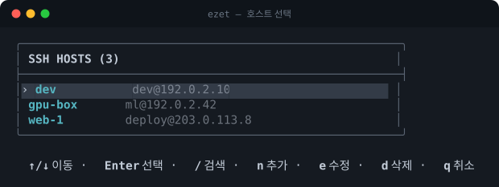
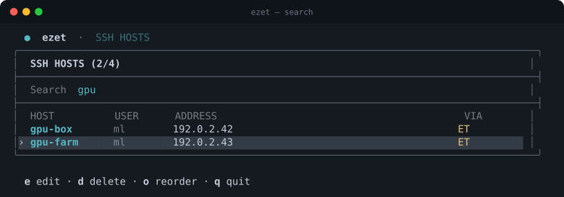
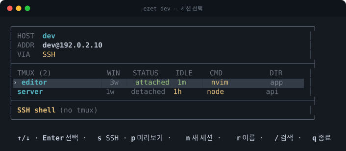
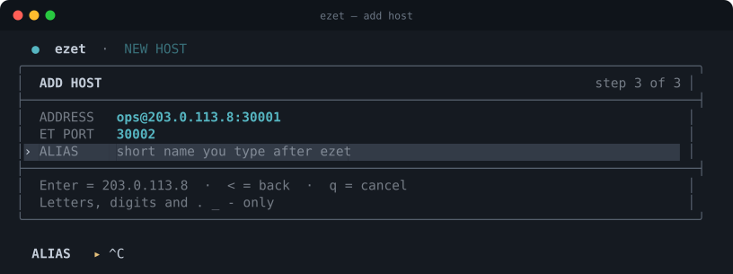

# ezet

[English](README.md) · 한국어

SSH·[Eternal Terminal](https://eternalterminal.dev/)·tmux 호스트와 세션을 고르는 대화형 CLI입니다. 순수 Bash로 동작하며, ET를 사용할 수 없으면 SSH로 자동 전환합니다.

- **tmux 세션 관리** — 원격 세션을 조회·생성·수정하고 바로 attach합니다.
- **자동 재연결** — Eternal Terminal(ET)을 우선 사용해 노트북을 닫거나 네트워크가 바뀌어도 세션을 유지·재연결합니다.
- **깔끔한 세션 종료** — `--close-on-hangup`을 지원하는 ET 클라이언트(2026-09-21 이후 master)라면 창을 닫을 때 서버 쪽 세션도 함께 끝나, `etserver`에 버려진 세션과 복구 버퍼가 쌓이지 않습니다. 예전 클라이언트도 그대로 동작하며, `ezet --doctor`가 어느 쪽인지 알려줍니다.
- **SSH 폴백** — ET를 설치하지 않았거나 tmux를 사용할 수 없는 호스트는 일반 SSH로 접속합니다.

[](https://github.com/zoo3323/ezet/actions/workflows/test.yml)
[](LICENSE)

## 사용 화면

호스트와 tmux 세션을 한 화면에서 선택합니다.

호스트 선택:



검색으로 목록 좁히기:



tmux 세션 선택:



새 호스트 추가:



## 설치

```bash
brew install zoo3323/tap/ezet
```

또는:

```bash
curl -fsSL https://raw.githubusercontent.com/zoo3323/ezet/main/install.sh | bash
```

ET 자동 재연결을 사용하려면 로컬에 `et`, 원격 호스트에 `etserver`를 설치하세요. 설치하지 않아도 SSH로 접속할 수 있습니다.

## 사용

```bash
ezet                 # 호스트 선택
ezet <host>          # 세션 선택
ezet <host> <name>   # 세션 바로 연결
ezet --doctor        # 설정 점검
ezet --version
```

화면에서는 방향키로 이동하고 `Enter`로 선택합니다. 호스트 화면에서 호스트를 추가·수정·삭제하고 순서를 변경할 수 있으며, 세션 화면에서 tmux 세션을 attach·생성하거나 `SSH Direct` 행으로 tmux 없이 접속할 수 있습니다. `q`는 종료, `←`는 이전 화면입니다.

추가·수정 폼에서는 `Enter`가 표시된 기본값을 그대로 받고, `<`는 앞 칸으로, `q`는 취소입니다.

## 요구 사항

- Bash 3.2+
- OpenSSH (`ssh`)
- Eternal Terminal (`et`, 선택)
- 원격 `tmux` (선택; 없으면 `SSH Direct` 로 접속)

로컬 tmux는 필요하지 않습니다.

## 지원 플랫폼

ezet은 **macOS와 Linux**에서 동작합니다(WSL 포함 — WSL은 스스로를 Linux로 보고합니다).
두 환경 모두 푸시마다 CI 매트릭스로 검증됩니다.

**윈도우에서 직접 실행하는 것은 지원하지 않습니다.** `--doctor`가 Git Bash·MSYS2를
거부합니다. ezet이 기록하는 `Include` 줄이 MSYS 경로(`/c/Users/...`)여서 Windows
OpenSSH가 해석할 수 없기 때문입니다. 윈도우에서는 WSL을 쓰세요.

**원격 호스트가 윈도우인 경우는 지원합니다.** 셸이 POSIX가 아니라 tmux 조회를 실행할
수 없는데, ezet이 이를 감지해 `non-POSIX shell (e.g. Windows)`로 표시하고 tmux 없이
접속하는 `SSH Direct` 행을 제공합니다. 이 경로는 실제 cmd.exe 동작(여러 줄 명령의 첫
줄만 실행하고 종료코드 0)을 재현하는 대역으로 테스트에서 검증합니다.

## SSH 설정

ezet 호스트는 `~/.ssh/config.d/ezet`에 저장됩니다. 기존 설정에는 `Include` 한 줄만 추가하며, 변경 전 백업을 만듭니다. ET 포트는 다음처럼 주석으로 저장됩니다.

```sshconfig
Host host-ext
    HostName 203.0.113.10
    User user
    Port 30001
    # ezet: et-port 30002
```

`ezet --uninstall`은 ezet이 추가한 `Include`만 제거합니다.

## 개발

```bash
make test    # 회귀 테스트 (bash -n, shellcheck, expect)
make docs    # README 스크린샷을 실제 TUI 에서 다시 생성
```

`make docs`는 고정 픽스처로 실제 TUI를 expect로 몰아 터미널 출력을 그대로 SVG로 바꿉니다. 그래서 스크린샷이 UI와 어긋날 수 없습니다.

## 라이선스

[MIT](LICENSE)
