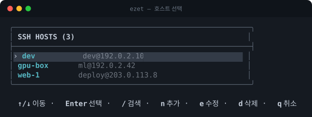
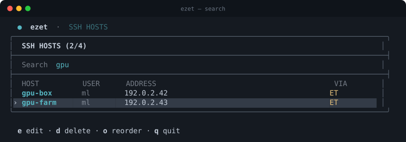
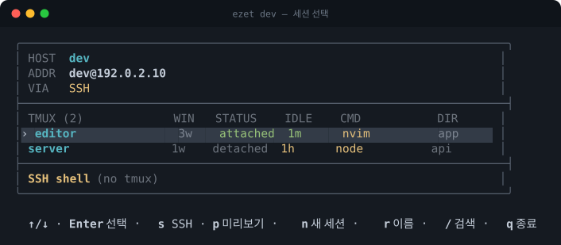
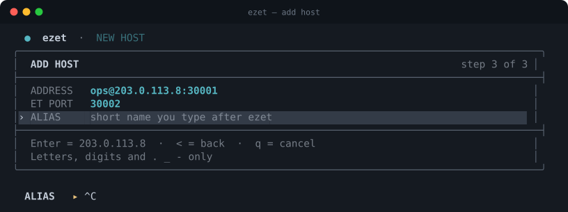

# ezet

English · [한국어](README.ko.md)

An interactive CLI for picking SSH · [Eternal Terminal](https://eternalterminal.dev/) · tmux hosts and sessions. Pure Bash, and it falls back to plain SSH whenever ET is unavailable.

- **tmux session management** — list, create and rename remote sessions, then attach right away.
- **Auto-reconnect** — prefers Eternal Terminal (ET), so sessions survive a closed laptop lid or a network change.
- **Opt-in session close** — ezet passes `--close-on-hangup` only for an explicitly enabled Host and a client that supports it. The request may not reach the server depending on the connection state, and requires matching ET components.
- **SSH fallback** — hosts without ET, or without a usable tmux, are reached over plain SSH.

[](https://github.com/zoo3323/ezet/actions/workflows/test.yml)
[](LICENSE)

## Screens

Hosts and tmux sessions are picked from the same dashboard.

Host picker:



Narrowing the list with search:



Session picker:



Adding a host:



## Install

```bash
brew install zoo3323/tap/ezet
```

or:

```bash
curl -fsSL https://raw.githubusercontent.com/zoo3323/ezet/main/install.sh | bash
```

For ET auto-reconnect, install `et` locally and `etserver` on the remote host. Without them ezet still connects over SSH.

## Usage

```bash
ezet                 # pick a host
ezet <host>          # pick a session
ezet <host> <name>   # connect to a session directly
ezet --doctor        # check the setup
ezet --version
```

Move with the arrow keys and pick with `Enter`. The host screen adds, edits, deletes and reorders hosts; the session screen attaches or creates tmux sessions, or connects without tmux through the `SSH Direct` row. `q` quits and `←` goes back to the previous screen.

In the add and edit forms, `Enter` accepts the shown default, `<` steps back to the previous field and `q` cancels.

## Requirements

- Bash 3.2+
- OpenSSH (`ssh`)
- Eternal Terminal (`et`, optional)
- Remote `tmux` (optional; without it ezet connects through `SSH Direct`)

A local tmux is not needed.

ezet compares runnable tmux versions in PATH, user installs, Homebrew and other common locations, and selects the newest installed version. It uses a server socket named `ezet-<version>` consistently for listing, attaching and renaming sessions, including `ezet host session` quick connects. After upgrading remote tmux, reconnect to ezet to use the new version. Existing default-server or older-version sessions are left running; they are not migrated or shown in the new server. Access those with their original tmux/socket command. This does not install or upgrade tmux itself. For terminal foreground/background color detection, use tmux 3.4 or later; no fixed color palette is required.

## Platforms

ezet runs on **macOS and Linux** (WSL included, since it reports itself as Linux).
Both are covered by the CI matrix on every push.

It does **not** run on Windows natively: `--doctor` rejects Git Bash/MSYS2, because
the `Include` line ezet writes uses an MSYS path (`/c/Users/...`) that Windows
OpenSSH cannot resolve. Use WSL there.

A **Windows host on the remote side is supported**. Its shell is not POSIX, so the
tmux query cannot run; ezet detects that, reports `non-POSIX shell (e.g. Windows)`
and offers the `SSH Direct` row to connect without tmux. This path is covered by the
test suite with a stub that reproduces the real cmd.exe behaviour (it runs only the
first line of a multi-line command and still exits 0).

To see the tmux sessions inside WSL on a Windows host, set OpenSSH's default shell
to WSL bash on that machine (admin PowerShell):
`New-ItemProperty -Path "HKLM:\SOFTWARE\OpenSSH" -Name DefaultShell -Value "C:\Windows\System32\bash.exe" -PropertyType String -Force`.
This only changes SSH logins; local PowerShell and cmd windows are unaffected.

## SSH config

ezet hosts live in `~/.ssh/config.d/ezet`. Your existing config only gains a single `Include` line, and it is backed up before the change. ET ports are stored as a comment:

```sshconfig
Host host-ext
    HostName 203.0.113.10
    User user
    Port 30001
    # ezet: et-port 30002
```

After verifying both remote ET components use [PR #837](https://github.com/MisterTea/EternalTerminal/pull/837), opt an ezet-owned `Host` block with no wildcards in by adding this marker:

```sshconfig
# ezet: close-on-hangup yes
```

The marker is recognized in this form inside an ezet-owned `Host` block; it is ignored in wildcard or `Match` blocks and as a global setting. `ezet --doctor` reports local client support separately, but it cannot verify per-host activation or remote server state. A version string such as `7.0.0` alone does not confirm support.

`--close-on-hangup` closes a connected session on a best-effort basis through [PR #837](https://github.com/MisterTea/EternalTerminal/pull/837). The remote `etserver` and `etterminal` must both include the matching change; ezet cannot verify that, and a legacy server may treat the close packet as fatal. The option cannot help after a network loss, power failure, or forced kill, so keep the remote shell in tmux when you need recovery.

Editing ET connection settings in ezet clears the opt-in marker; alias-only renames preserve it. Recheck it after server changes, and restart ezet after upgrading this version.

An optional custom ET recovery-buffer patch outside ezet can lower the bound to 8 MiB; the earlier upstream proposal was withdrawn. It is a memory/recovery tradeoff, not a stale-session fix or a guarantee of a fixed memory ceiling; backpressure may pause reads, and tmux does not preserve unlimited ET scrollback. See [PR #846 discussion](https://github.com/MisterTea/EternalTerminal/pull/846#issuecomment-5753440337).

`ezet --uninstall` removes only the `Include` line ezet added.

### ET reconnect memory patch

[`tools/et-reconnect-memory.patch`](tools/et-reconnect-memory.patch) streams recovery output, preserves partial packets when recovery fails, and validates packet lengths before reading in bounded chunks. It preserves the existing wire protocol. The build helper selects an 8 MiB recovery buffer; connections that exceed that replay window can still fail to recover.

Prepare an ET checkout at `a8367415783a64405c62c70b755b4c09b410532b` with its submodules initialized, plus a compiler, CMake, protobuf, OpenSSL and libsodium development packages. Run `./tools/build-et-memory-fix.sh ET_SOURCE BUILD_DIR [cmake options...]`. On macOS, add `-DCMAKE_PREFIX_PATH=/opt/homebrew -DCMAKE_OSX_SYSROOT=$(xcrun --show-sdk-path)` if needed.

On a Linux server using `/usr/local/bin` and `et.service`, run `sudo ./tools/install-et-memory-fix.sh BUILD_DIR`. This restarts ET and disconnects clients; preserve work in tmux first. Previous binaries are saved under `/usr/local/lib/ezet-et-backup.*`, and the existing memory limit and restart policy are retained.

The patch derived from ET source is licensed under [Apache-2.0](tools/et-reconnect-memory.LICENSE).

## Development

```bash
make test    # regression tests (bash -n, shellcheck, expect)
make docs    # regenerate the README screenshots from the real TUI
```

`make docs` drives the actual TUI with expect against a fixed fixture and converts the captured terminal output to SVG, so the screenshots cannot drift from the UI.

## License

[MIT](LICENSE)
